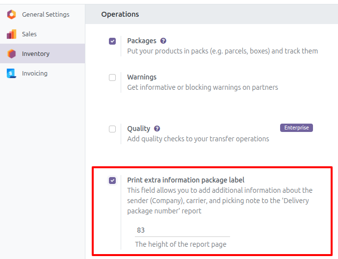
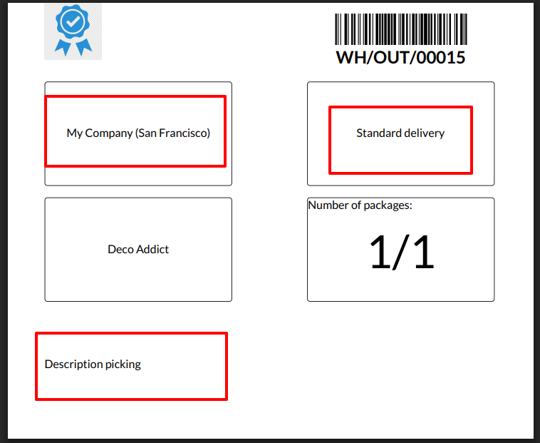

If no delivery packages are used:

1. Go to an open picking and click in the *Additional Info* tab.
2. In the *Delivey Information* section you'll find a **Number of
   packages** field that you can edit.

If delivey packages are used:

1. The field will be recomputed depending on the delivery packages used
   in the picking although can be edited at convenience later.

When the picking is confirmed, the user has the chance to change the
number of packages in the confirmation wizard.

Add extra information to the Delivery package number report

1. Go to *Settings* > *Inventory* > *Section operations*.
2. Check the *Print extra information package label* option.

3. This will allow you to add the sender, carrier and note values to the report.

4. A field is enabled to enter the height of the report, by default it is 50.
5. Done, start generating reports
