Create an account on sendcloud.com and choose a plan.
Go to integrations and select Odoo integration to use the Odoo integration or select
api integration if you only want to use the api integration (see readme for more
information).

## Odoo Integration

Verify that the value of "web.base.url" parameter in System Parameters is set with
the correct url (eg.: "https://demo.onestein.eu" instead of "http://localhost:8069").

Go to Sendcloud > Configuration > Wizards > Setup the Sendcloud Integration. A wizard will pop up.

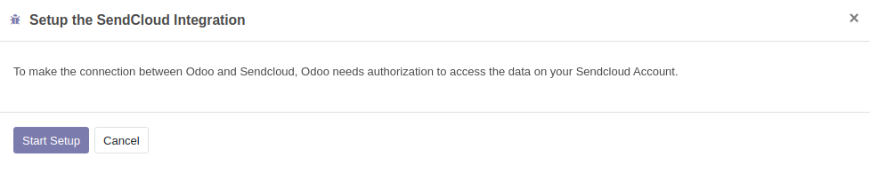

Select Odoo Integration. Start Setup. You will be redirected to a Sendcloud page asking you
to authorize OdooShop to access your Sendcloud account. Click on Connect in the Sendcloud page.

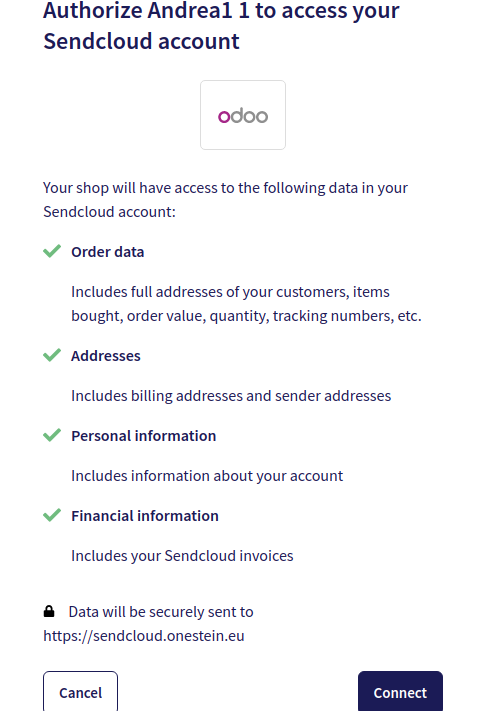

Go back to the Odoo Integration configuration. An integration "OdooShop" is now present
in the Integration list view. Open the OdooShop Integration form. Edit the OdooShop Integration.
The changes you make will be in sync, Sendcloud side, with the integration configuration.

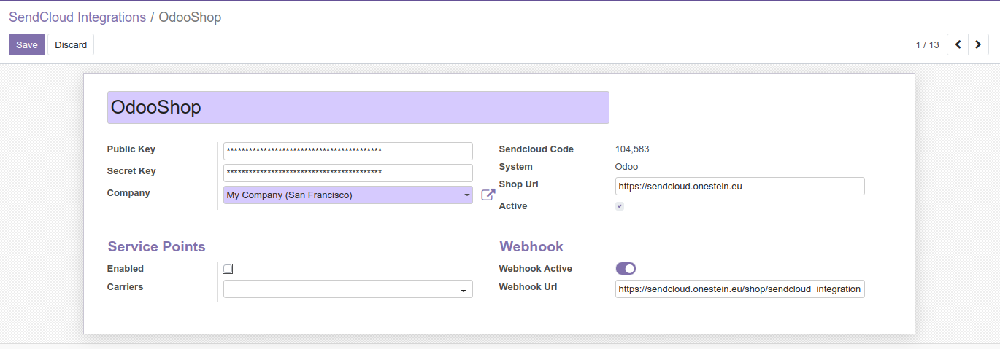

In case multiple integrations are present, sort the integrations by sequence, to allow
Odoo to choose the default one that will be used.
Please note that when using the Odoo integration an "incoming order" is created in
Sendcloud as soon as you validate the salesorder. The “incoming order” has status
“in process” in Sendcloud and is not forwarded to the carrier yet.

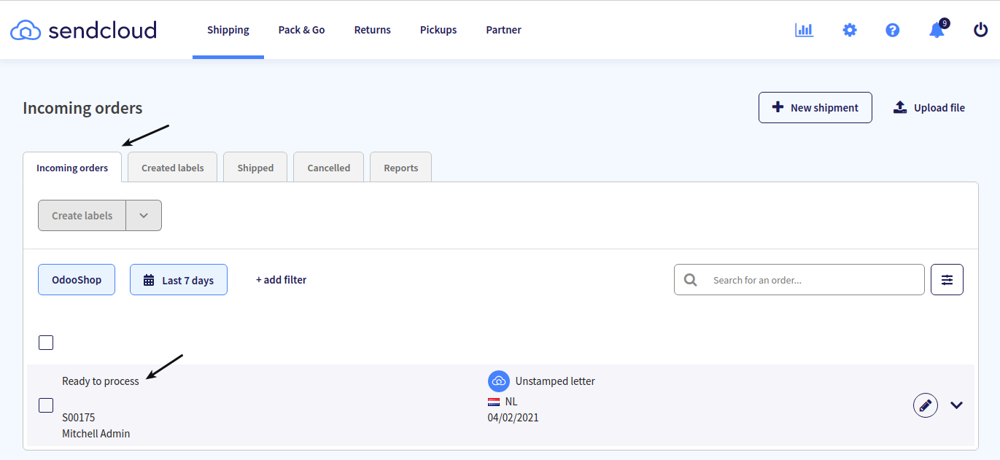

When you validate the delivery in Odoo the label is created and the pick-up assignment is send to the carrier.

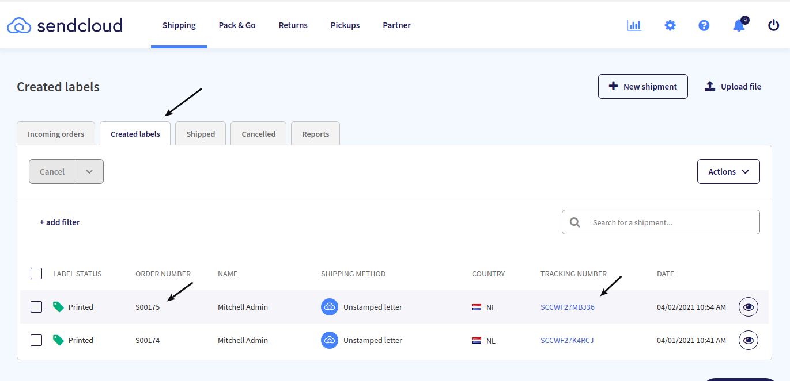

In previous version there was a possibility to connect to the API integration instead of the Odoo integration.
To benefit from Sendcloud support we highly recommend you to upgrade to the latest version of this module with
the Odoo integration.

## Sendcloud panel settings

When you configure the Integration settings in the online Sendcloud panel (https://panel.sendcloud.sc/)
those settings are also sync-ed with the Integration settings Odoo side.

## Synchronize Sendcloud objects

After the setup of the integration with Sendcloud server is completed, second step is
to synchronize the objects present in Sendcloud server to Odoo.
To synchronize Sendcloud objects for the first time:

- Go to Sendcloud > Configuration > Wizards > Sync the Sendcloud Objects. A wizard will pop up.

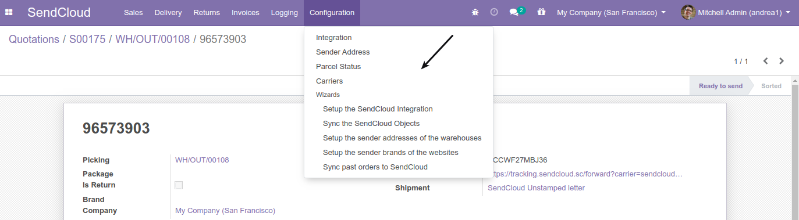

- Select all the objects. Confirm. This will retrieve the required data from Sendcloud server.

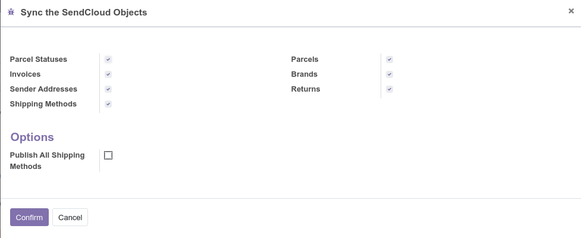

Some Sendcloud objects will be automatically synchronized from the Sendcloud server to Odoo.
Those Sendcloud objects are:

- Parcel Statuses
- Invoices
- Shipping Methods
- Sender Addresses

To configure how often those objects should be retrieved from the Sendcloud server:

- Go to Settings > Technical > Automation > Scheduled Actions. Search Scheduled Actions for "Sendcloud".

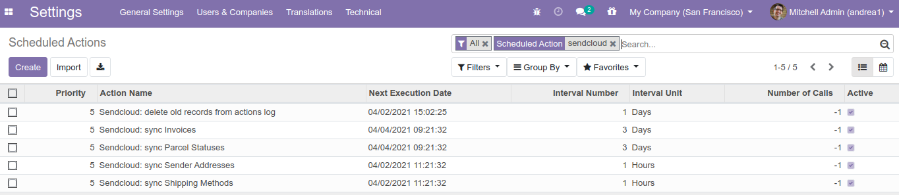

- Set the "Execute Every" value according to your needs.

Sender Addresses and Warehouses

In case of multiple warehouses configured in Odoo (eg.: user belongs to group "Manage multiple Warehouse"):

Go to Sendcloud > Configuration > Integration. Click on Configure Warehouse Addresses. A wizard will pop up.
Set the corresponding Sendcloud Sender Address for each of the warehouse addresses.

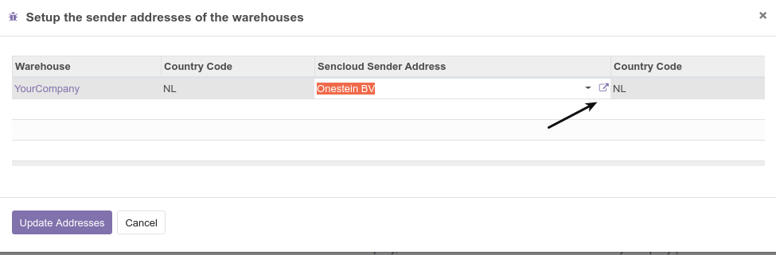

Alternatively, in Inventory > Configuration > Warehouses, select an address. In the address form, go to Sales and Purchase tab and set the Sencloud Sender Address.
In Sale Order > Delivery: select the Warehouse. Check that the address of the Warehouse has a Sendcloud Senser Address.

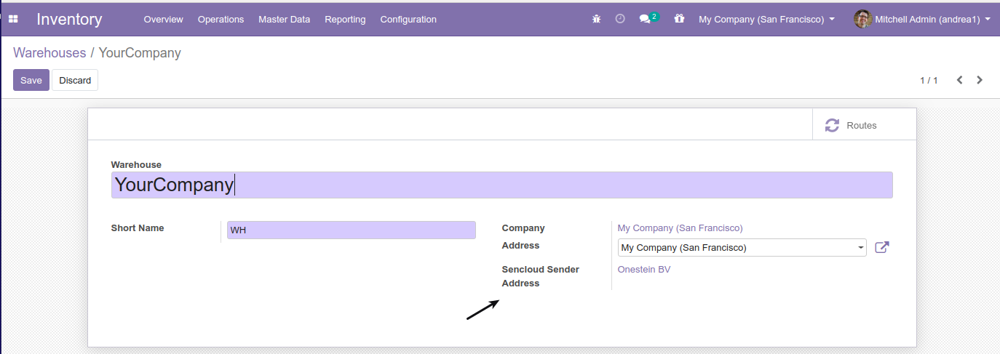

## Initial sync of past orders

Once all the previous configuration steps are completed, it is possible to synchronize
all the past Odoo outgoing shipments to Sendcloud.
Those shipments are the ones already setup with a Sendcloud shipping method.

Go to Sendcloud > Configuration > Wizards > Sync past orders to Sendcloud. A wizard will pop up.
Select the date (by default set to 30 days back from today) from which the shipments
must be synchronized.

Click on Confirm button: the shipments will be displayed in the Incoming Order View tab of the Sendcloud panel.
They will contain a status “Ready to Process” if they are ready to generate a label and the order fulfillment will continue.

## Auto create invoice

When sending a product outside the EU, Sendcloud requires an invoice number.
In case shipment is made with a product that can be invoiced based on delivered quantities,
this combination of factors prevents the label being created in Sendcloud when confirming the SO.

A possible solution is to automatically create a 100% down-payment invoice when shipping to outside the EU.
To enable this feature, go to the "General Settings": under the Sendcloud section you can find the "Auto create invoice" flag.
Notice: this feature is still in beta testing.

## Test Mode

To enable the Test Mode, go to the "General Settings": under the Sendcloud section you can find the "Enable Test Mode" flag.
Enabling the Test Mode allows you to access extra functionalities that are useful to test the connector.

There is no seperate test environment available on the Sendcloud portal. This means that
as soon as you create labels the carries is given the order to pickup the goods.
You can use carrier "unstamped letter" for testing.
When testing with other carriers make sure that you cancel the labels in the Sendcloud portal
within a couple of hours otherwise the label will be billed and picked up.

Since there is no test environment it's very important to know that Sendcloud stores it
records based on the delivery number, for instance WH/OUT/0001, this field is idempotent.
So when you start testing and you will use delivery number WH/OUT/00001 this number is
stored in Sendcloud. When you go live and use the same delivery numbers, in this case WH/OUT/00001,
Sendcloud will treat this as an update of the existing record and will send back the
shipping-address that was already stored (created while testing). To avoid this problem
you should set a different prefix on the sequence out in your testenvironment.
In debug mode, Technical/Sequences Identifiers/Sequences, select the sequence out and
adjust this to WH/OUT/TEST for instance.

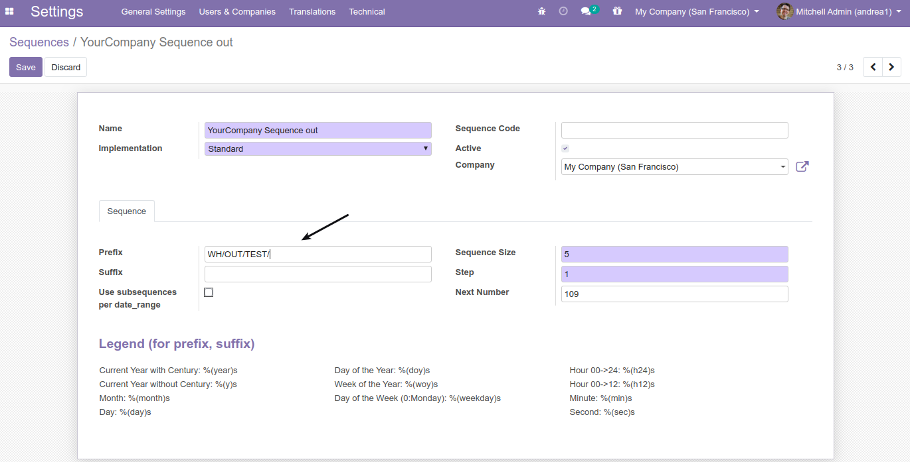
